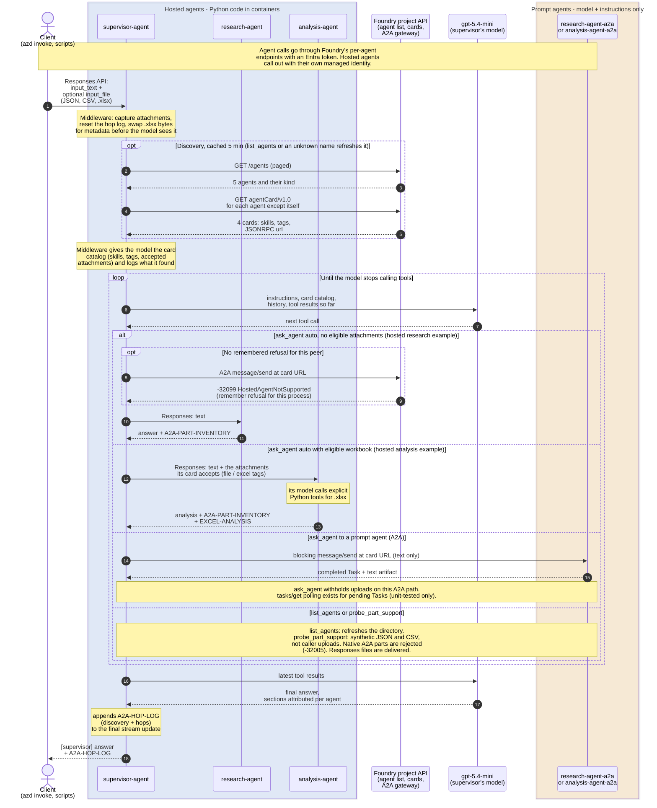

# Why five agents?

Recorded deployment on **2026-09-28**: `project-a2a-poc`, account
`foundry-fha-kxusxjc5tkc3y`.

| Agent | Kind / version | Role |
|---|---|---|
| `supervisor-agent` | hosted / 5 | Python orchestration with `ask_agent`, `list_agents`, `probe_part_support` and a hop log |
| `research-agent` | hosted / 3 | Research from supplied content/model knowledge; receipt evidence; no browsing tool |
| `analysis-agent` | hosted / 4 | Dataset analysis, four explicit Excel tools, receipt and calculation evidence |
| `research-agent-a2a` | prompt / 1 | Independent research persona, model and instructions only |
| `analysis-agent-a2a` | prompt / 1 | Independent quantitative persona, model and instructions only |

The hosted agents run Python 3.13 and deploy through [azure.yaml](./azure.yaml).
[deploy_a2a_frontends.py](./scripts/deploy_a2a_frontends.py) creates versions of the two
prompt agents, with no tools, and enables both Responses and A2A on their endpoints.

**Why the extra two?** The tested Foundry gateway refused hosted A2A targets
(`-32099 HostedAgentNotSupported`). Prompt targets completed text-only A2A Tasks.
They let the POC demonstrate A2A without claiming that it invokes the hosted Python code.
Native A2A data/file parts were rejected (`-32005`); this is a measured Foundry limitation,
not a restriction of every A2A implementation.

**They are not proxies.** Calling a `-a2a` agent does not call its hosted namesake or its
Excel tools. Both research cards advertise `research-brief`, so the model can select
either for a text task. Check `peer` in the hop log to see who answered.

**Discovery and files.** The supervisor reads project agents and their cards, excludes
itself using `FOUNDRY_AGENT_NAME`, and caches the directory for 5 minutes.
`list_agents` and an unknown-name lookup refresh it. No peer map is configured.
Ordinary delegation sends uploads only to a selected peer with the relevant skill tag:
`file` for non-workbook attachments, `excel` for `.xlsx`. Currently research has `file`,
analysis has both, and the prompt agents have neither. These tags control forwarding,
not file-format support or trust; prompt-agent multipart Responses support was not tested.

See the [README](./README.md) for exact Excel limits, verification results and the plan
to retire the front-ends after hosted inbound A2A support is reverified.

## Call flow

This illustrates the recorded deployment's normal paths, not a guaranteed tool order.
It starts with a supervisor request; the proof scripts also call specialists directly.

Mermaid source (the SVG above is rendered from this with Mermaid 11's default theme)

### Reading the evidence

- `auto` tries A2A only when no eligible attachments need forwarding and no refusal is
  remembered. After a hosted refusal, it uses Responses. Explicit `a2a` never falls back;
  explicit `responses` bypasses A2A.
- The research-before-analysis order is an instruction, not an enforced dependency.
  Calls may run concurrently.
- Discovery is an initial per-turn snapshot, not a live health guarantee. Card-fetch
  failures omit the peer with a warning; directory-listing failures appear in the hop log.
- The supervisor appends discovery and hops; hosted specialists report received content.
  Analysis adds workbook hashes and tool results. These are application diagnostics,
  not signed attestations or proof of caller isolation.
