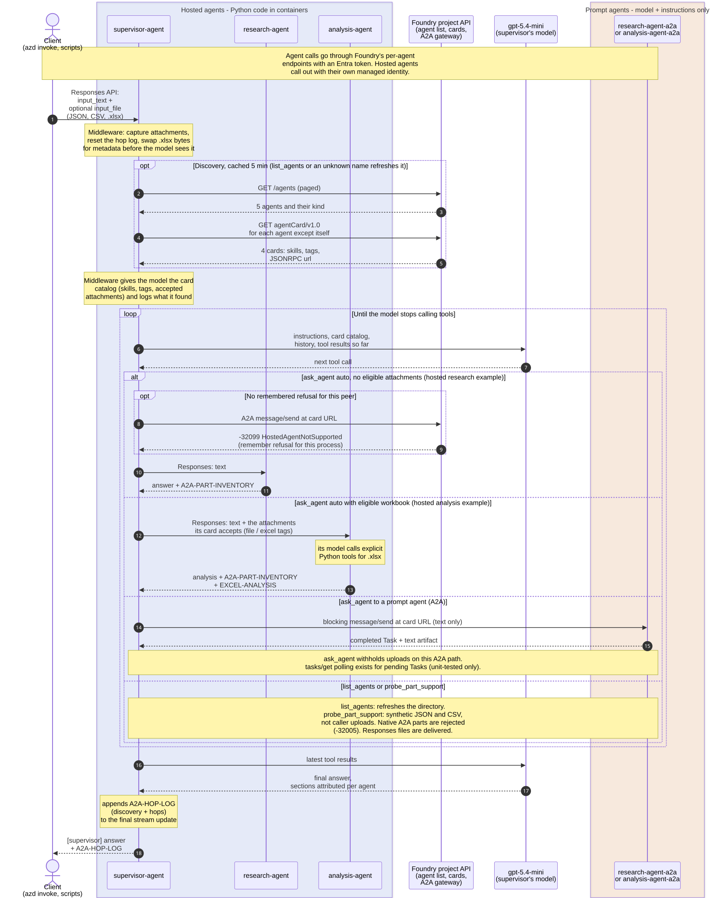
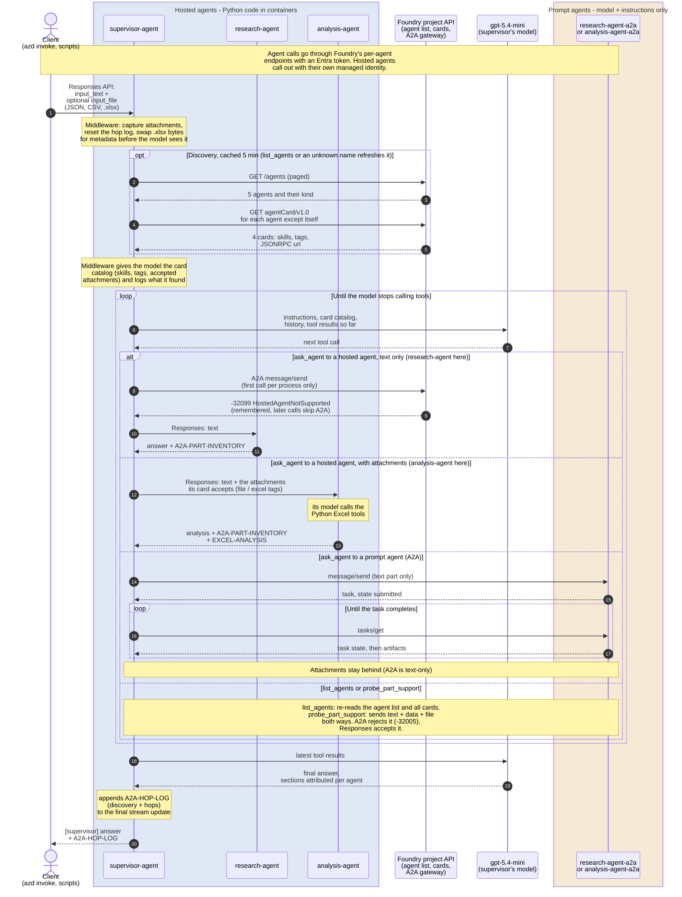

In the Foundry portal, I see a list of 5 agents in `project-a2a-poc` (account `foundry-fha-kxusxjc5tkc3y`), as of 2026-09-28:
- supervisor-agent
- analysis-agent
- research-agent
- analysis-agent-a2a
- research-agent-a2a

The two `-a2a` agents are **prompt agents**: just a model plus an instructions string. The
other three are **hosted agents**: the POC's Python code running in containers. The portal's
"Type" column says "Agent" for all five, so it hides this difference. The live agent
definitions show `kind: prompt` for the two `-a2a` agents and `kind: hosted` for the other
three.

**Why they exist:** Foundry won't accept an incoming A2A call to a hosted agent (it returns
`-32099 HostedAgentNotSupported`). To show a real A2A call working (`message/send`, then the
task running to completion), the POC needed prompt agents on the receiving end.
[deploy_a2a_frontends.py](./scripts/deploy_a2a_frontends.py) creates them and turns on A2A
for each.

**How the supervisor finds them:** it has no list of names. Each turn it lists the project's
agents, reads the A2A card of every agent except itself, and its model picks agents by the
skills on those cards. So it sees 4 peers, and the two `-a2a` agents show up as peers in
their own right. `research-agent-a2a` has the same `research-brief` skill as
`research-agent`. In the catalog they differ by description, by `kind` (prompt or hosted),
and by the attachment tags (`file`, `excel`), which only the hosted specialists have.

| | `research-agent-a2a`, `analysis-agent-a2a` | `supervisor-agent`, `research-agent`, `analysis-agent` |
|---|---|---|
| Type (live) | `prompt`: `gpt-5.4-mini` plus instructions, **no tools, no code** | `hosted`: Python 3.13 container running `main.py` (0.5–1 CPU) |
| Created by | `deploy_a2a_frontends.py`; not in `azure.yaml` | `azd deploy` from [azure.yaml](./azure.yaml) |
| Code behind it | None | Middleware that reports exactly what each agent received. `analysis-agent` has 4 Excel tools. `supervisor-agent` has 3 tools (`ask_agent`, `list_agents`, `probe_part_support`) and discovers the others from their cards at runtime |
| Can other agents call it over A2A? | Yes, text only | No (`-32099`) |
| Can it receive files or data? | No. Their cards have no `file` / `excel` tags, so the supervisor never forwards attachments to them | Yes, over the Responses API. The `file` tag on research's card and the `file` + `excel` tags on analysis's card are what make the supervisor forward attachments to them |
| Who calls it | The supervisor's `ask_agent` over A2A: when the caller asks for an A2A hop, or when the model picks one for a text-only sub-task. Also `probe_part_support` and the test script ([prove_a2a_parts.py](./scripts/prove_a2a_parts.py)) | research/analysis: the supervisor's `ask_agent`, the path that does the real work. Text tries A2A first, is refused, and then uses Responses; attachments go straight over Responses. supervisor: the client |
| Card skills | 1 each, no attachment tags: `research-brief`; `quantitative-review` | supervisor: 2; research: 2, incl. `document-review` (`file`, `data`); analysis: 3, incl. `excel-analysis` (`excel`, `file`, `analysis`) |
| Versions | v1; changes only when the script is re-run | New version on every `azd deploy`; now supervisor v5, research v3, analysis v4 |

**The main thing to know: they are not proxies.** Calling `research-agent-a2a` never reaches
`research-agent`. It's a separate model answering from its own copied instructions, and those
instructions differ from the originals:

- The hosted [research-agent](./src/research-agent/main.py#L18) and
  [analysis-agent](./src/analysis-agent/main.py#L20) are told to use attachments, cite sources
  and use the Excel tools.
- The `-a2a` copies are told they only get text.

So their answers can differ from the hosted agents' answers and will drift if either side is
edited. A successful A2A call to them shows that A2A works. It says nothing about how the
hosted specialists behave. When "supervisor talks to research over A2A", it is really talking
to a stand-in for research. With card-based routing, the model can also pick a stand-in for
a text-only sub-task, because both research agents advertise the same skill. The hop log's
`peer` field says which agent actually answered. The [README](./README.md)'s convergence
plan is to retire both once Foundry accepts incoming A2A calls to hosted agents.

**Call flow, starting from the client call:**

Mermaid source (the SVG above is rendered from this with Mermaid 11's default theme)

How to read it:

- **Start:** the client only ever calls `supervisor-agent`, over the Responses API.
- **Discovery:** before its model runs, the supervisor lists the project's agents and reads
  every card except its own (cached for 5 minutes). No peer names are configured. The
  hop log's `discovery` block shows what was found.
- **The loop:** each round, the supervisor's model picks an agent from the card catalog and
  a tool, so routing is decided by the model and the cards, not hard-coded. The
  instructions say to call research first when both specialists are needed, but the order
  isn't guaranteed. In the measured runs the model often called both at once.
- **Hosted agents, text only:** `ask_agent` tries A2A first, at the URL on the card. The
  Foundry gateway refuses hosted targets (`-32099`), so the supervisor falls back to
  Responses and remembers the refusal. Later calls in the same process go straight to
  Responses.
- **Attachments:** they always go over Responses, and only to agents whose card skills carry
  the matching tag (`file`, or `excel` for `.xlsx`). Today research gets JSON and CSV but not
  `.xlsx`, analysis gets everything, and the `-a2a` stand-ins get nothing.
- **Prompt agents:** reached over A2A as text only, when the caller asks for an A2A hop or
  the model picks one for a text-only sub-task.
- **End:** the hop log (discovery plus every hop) is added to the final answer before it
  returns to the client.

